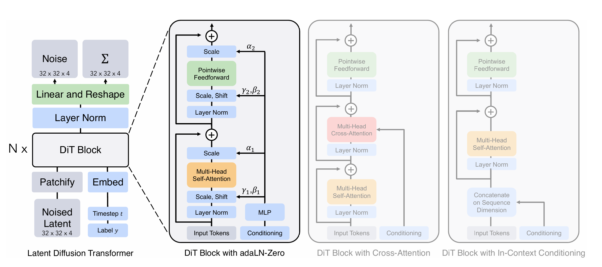

# Diffusion Transformer

## 1.模型原理

Diffusion Transformer模型本质上是[Diffusion Model](https://github.com/JiaxingSong718/DifussionModel)，只是将图像部分的`UNet`卷积网络换成了[Vision Transformer](https://github.com/JiaxingSong718/VisionTransformer)网络，而[Vision Transformer](https://github.com/JiaxingSong718/VisionTransformer)网络则基于transformer的Encoder部分处理图像。

在[Diffusion Model](https://github.com/JiaxingSong718/DifussionModel)复现模型中，已经尝试过使用`cross-attention`结构引导图像生成的数字，而在Diffusion Transformer模型中论文采用`adaLN-Zero`方式引导图像生成。

重要的超参数如下，参数规模必须到达一定量级才能收敛：

- embedding采用64位
- Diffusion Transformer Block采用3头注意力，堆叠3层



具体的训练过程参考[Diffusion Model](https://github.com/JiaxingSong718/DifussionModel)

## 2. 实现

基于mnist手写数字数据集的Diffusion Transformer模型复现

### 模型训练

```
python train.py
```

### 模型效果

可以通过引导词生成0-9之间的手写数字。

```
python denoise.py
```


## Reference

[Scalable Diffusion Models with Transformers](https://arxiv.org/pdf/2212.09748)

[mnist-dits](https://github.com/owenliang/mnist-dits)

